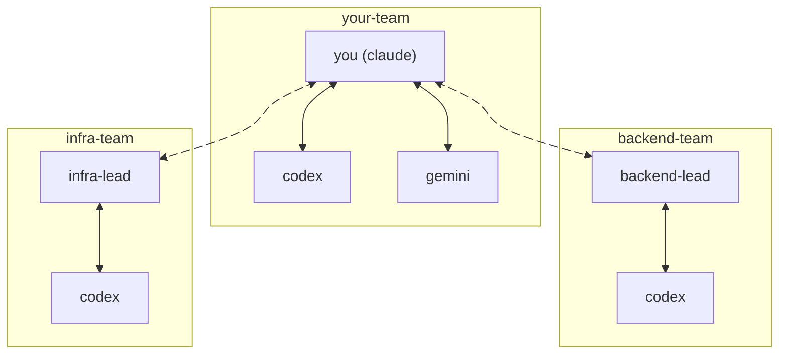

# tmux-team

Coordinate AI agents (Claude, Codex, Gemini) running in tmux panes. Send messages, wait for responses, broadcast to all.

## Install

```bash
npm install -g tmux-team
```

**Requirements:** Node.js >= 18, tmux

**Alias:** `tmt` (shorthand for `tmux-team`)

## Quick Start

```bash
# 1. Install for your AI agent
tmt install claude   # or: tmt install codex

# 2. Go to working folder and initialize
tmt init

# 3. Register agents (run inside each agent's pane)
tmt this claude      # registers current pane as "claude"
tmt this codex       # registers current pane as "codex"

# 4. Talk to agents
tmt talk codex "Review this code"    # waits for response by default

# 5. Update or remove an agent
tmt update codex --pane 2.3
tmt rm codex
```

> **Tip:** Most AI agents support `!` to run bash commands. From inside Claude Code, Codex, or Gemini CLI, you can run `!tmt this myname` to quickly register that pane.

## Cross-Folder Collaboration

Agents don't need to be in the same folder to collaborate. You can add an agent from one project to another:

```bash
# In project-a folder, add an agent that's running in project-b
tmt add codex-reviewer 5.1    # Use the pane ID from the other project
```

Find pane IDs with: `tmux display-message -p "#{pane_id}"`

## Commands

| Command | Description |
|---------|-------------|
| `install [claude\|codex]` | Install tmux-team for an AI agent |
| `this <name> [remark]` | Register current pane as an agent |
| `talk <agent> "msg"` | Send message and wait for response |
| `talk all "msg"` | Broadcast to all agents |
| `check <agent> [lines]` | Read agent's pane output |
| `list` | Show configured agents |
| `learn` | Show educational guide |

**Options for `talk`:**
- `--timeout <seconds>` - Max wait time (default: 180s)
- `--lines <number>` - Lines to capture from response (default: 100)

Run `tmt help` for all commands and options.

## Message Delivery

tmux-team uses tmux buffers + paste, then waits briefly before sending Enter. This avoids shell history expansion and handles paste-safety windows in CLIs like Gemini.

**Config:** `pasteEnterDelayMs` (default: 500)

```bash
tmt config set pasteEnterDelayMs 500
```

## Managing Your Team

Configuration lives in `tmux-team.json` in your project root.

**List** - Show configured agents:
```bash
tmt ls
```

**Edit** - Modify `tmux-team.json` directly:
```json
{
  "$config": { "pasteEnterDelayMs": 500 },
  "codex": { "pane": "1.1", "remark": "Code reviewer" },
  "gemini": { "pane": "1.2", "remark": "Documentation" }
}
```

**Remove** - Delete an agent:
```bash
tmt rm codex
```

---

## Shared Teams

> *Work on different folders but talk to the same team of agents.*

By default, `tmux-team.json` is local to each folder. The `--team` flag lets agents across different folders share a team:

```bash
# Initialize a shared team
tmt init --team myproject

# Register agents from ANY folder
cd ~/code/frontend && tmt this claude --team myproject
cd ~/code/backend && tmt this codex --team myproject
cd ~/code/infra && tmt this gemini --team myproject

# Now talk to them from anywhere
tmt talk codex "What's the user API schema?" --team myproject
tmt talk all "Starting deploy - heads up" --team myproject
```

> **Tip:** Most AI coding agents (Claude Code, Codex, Gemini CLI) support `!` to run shell commands. Agents can register themselves without leaving the session:
> ```
> !tmt this claude --team myproject
> ```

### When to use shared teams

**Single project** (default) — agents work in the same folder:
```bash
tmt init
tmt this claude
tmt add codex 1.1
```

**Shared team** — agents work across folders but collaborate:
```bash
tmt init --team acme-app
tmt this frontend-claude --team acme-app   # from ~/acme/frontend
tmt this backend-codex --team acme-app     # from ~/acme/backend
```

### Multi-team coordination

For large systems, create team hierarchies where leaders coordinate sub-teams:



---

## Using /team in Claude Code

The `/team` command lets Claude talk to other AI agents directly. Install the plugin:

```
/plugin marketplace add wkh237/tmux-team
/plugin install tmux-team
```

### /team Commands

| Command | What it does |
|---------|--------------|
| `/team list` | Show all registered agents |
| `/team talk <agent> "msg"` | Send a message and wait for response |
| `/team talk all "msg"` | Broadcast to all agents |

### Real-World Examples

**Code review delegation:**
```
/team talk codex "Review my changes in src/auth/ for security issues"
```

**Cross-agent coordination:**
```
/team talk all "Starting database migration - hold off on API changes"
```

**Ask a specialist:**
```
/team talk gemini "What's the best practice for rate limiting in GCP?"
```

### Tips

- `/team talk` waits for the agent to respond before continuing
- Use `/team list` to see who's available
- Run `/learn` once per session to teach Claude the full tmux-team workflow

## Learn More

```bash
tmt learn   # Comprehensive guide
tmt help    # All commands and options
```

## License

MIT
