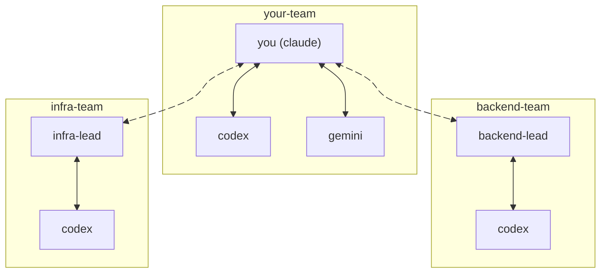

# tmux-team

Coordinate AI agents (Claude, Codex, Gemini) running in tmux panes. Send messages, wait for responses, broadcast to all.

## Install

```bash
npm install -g tmux-team
tmt install
```

`tmt install` auto-detects Claude Code, Codex, and Gemini. Codex and Gemini
share a managed skill link at `~/.agents/skills/tmux-team`; Claude gets its own
integration. Repeating the command is idempotent, and unmanaged files are
backed up only with `--force`. Use `tmt upgrade` to update the package; managed
skill links immediately use the new bundled files. Interactive commands make a
once-daily cached update check, while local drift checks work without network.

**Requirements:** Node.js >= 18, tmux

**Alias:** `tmt` (shorthand for `tmux-team`)

## What's new in 5.0

- `tmt name <global-name>` assigns a global identity to the current pane.
- `tmt this <global-name>` remains a supported, exact alias for `tmt name`.
- `tmt add <pane-target> <global-name>` assigns an identity to an explicit pane
  after resolving the target to tmux's stable `%pane_id`.
- `tmt whoami` and `tmt unbind` inspect and remove the current pane's identity.
- Multiline messages now preserve real line breaks when delivered.
- Skills can be installed and refreshed with `tmt install` and `tmt upgrade`.

## Quick Start

```bash
# 1. Assign global identities (run inside each agent's pane)
tmt name claude      # binds the current pane as "claude"
tmt this codex       # exact alias for `tmt name codex`
# Or bind an explicit pane target; it is stored by stable `%pane_id`
tmt add 10.1 gemini

# 2. Talk to agents
tmt talk codex "Review this code"    # waits for response by default

# 4. Inspect or remove the current pane's identity
tmt whoami
tmt unbind

# List panels in the session
tmt ls 

# `name` is an identity command; any title update is only a best-effort side effect.
tmt name backend
```

> **Tip:** Most AI agents support `!` to run bash commands. From inside Claude Code, Codex, or Gemini CLI, you can run `!tmt this myname` to quickly register that pane.

### How scopes work

Global identities live in tmux pane metadata, not in a JSON file you have to
track. `tmt name`, `tmt this`, and `tmt add` write the same global identity
record, independent of the current working folder. `tmt whoami` and `tmt unbind`
operate on the current pane. The identity name may be an undeclared name; it
does not need to match a configured agent role. Each pane has at most one
global identity and each global name identifies at most one pane.

Shared-team and workspace-scoped registrations remain separate from this
global identity contract.

Reach for `--team <name>` only when you want an explicit shared team that spans
folders (see [Shared Teams](#shared-teams)).

## Cross-Folder Collaboration

Agents don't need to be in the same folder to collaborate. From your current
workspace you can add an agent whose pane lives in another project:

```bash
# In project-a folder, add an agent that's running in project-b
tmt add 5.1 codex-reviewer    # The target is resolved and stored as `%pane_id`
```

Find pane IDs with: `tmux display-message -p "#{pane_id}"`

This still uses the default workspace scope: the registration is visible from
project-a, not from project-b. For long-running collaboration that should be
visible on both sides, use a [shared team](#shared-teams).

## Commands

| Command | Description |
|---------|-------------|
| `install [claude\|codex\|gemini\|all]` | Install or repair agent integrations |
| `upgrade` | Upgrade tmux-team; managed skill links update automatically |
| `name <global-name>` | Bind the current pane to a global identity |
| `this <global-name>` | Exact supported alias for `name` |
| `add <pane-target> <global-name>` | Bind an explicit pane to a global identity |
| `whoami` | Show the current pane's global identity, if any |
| `unbind` | Remove the current pane's global identity |
| `talk <agent> "msg"` | Send message and wait for response |
| `talk all "msg"` | Broadcast to all agents |
| `check <agent> [lines]` | Read agent's pane output |
| `list [team\|pane]` | Show current workspace agents, one shared team, or one pane's registrations |
| `migrate [--dry-run] [--cleanup]` | Move legacy `tmux-team.json` entries into tmux pane metadata |
| `team` | List shared team names |
| `team ls <team>` | List members of a shared team |
| `team add <team> <name> [pane]` | Add current or specified pane to a shared team |
| `team panes [--json]` | Inspect tmux panes grouped by scope |
| `team rm <team> --force` | Remove a shared team registration from every pane |
| `learn` | Show educational guide |

**Options for `talk`:**
- `--timeout <seconds>` - Max wait time (default: 180s)
- `--lines <number>` - Lines to capture from response (default: 100)

Run `tmt help` for all commands and options.

`tmt name <global-name>` binds the current pane to a global identity.
`tmt this <global-name>` has exactly the same behavior and is not deprecated.
Use `tmt add <pane-target> <global-name>` to bind another pane; targets may be
`%pane_id`, `window.pane`, or `session:window.pane`, and are stored by the
resolved stable `%pane_id`. `tmt whoami` reports the current binding and
`tmt unbind` removes only the current pane's binding. A pane title may be
updated as a best-effort presentation side effect, but titles are not the
identity API and there is no panel-title command.

## Message Delivery

tmux-team uses tmux buffers + paste, then waits briefly before sending Enter. This avoids shell history expansion and handles paste-safety windows in CLIs like Gemini.

**Config:** `pasteEnterDelayMs` (default: 500)

```bash
tmt config set pasteEnterDelayMs 500
```

## Managing Your Team

Agent registrations live in tmux pane metadata, scoped per workspace by
default. The same-folder workflow never needs `--team`.

**List agents and status:**
```bash
tmt ls              # agents in this workspace
tmt ls myproject    # members of a shared team
tmt ls 10.1         # registrations on a pane
tmt ls main.10.1    # shorthand for main:10.1
```

**Manage shared teams** with the `team` namespace:

```bash
tmt team                         # list shared team names
tmt team ls myproject            # list team members
tmt team add myproject claude    # add current pane to a team
tmt team add myproject codex 1.1 # add a specific pane to a team
tmt team rm myproject --force    # remove a team from every pane
```

A single pane can belong to multiple teams. Commands never guess across teams:
`tmt talk codex` uses the current workspace, while `tmt talk codex --team
myproject` uses only that shared team. If an agent name appears in multiple
shared teams and is not in the current workspace, tmux-team asks you to specify
the team.

**Inspect every tmux pane** with `tmt team panes`. Output is grouped by scope —
shared teams first, then workspaces, then unregistered panes — and each
section's title lists the agents living there:

```
Team: acme-app (codex, gemini)
PANE   TARGET             CWD              CMD
%12    main:1.0           ~/acme/frontend  node
%17    main:2.0           ~/acme/backend   python

Workspace: ~/dev/tmux-team (claude)
PANE   TARGET             CWD              CMD
%3     work:0.1           ~/dev/tmux-team  node

Unregistered panes
PANE   TARGET             CWD              CMD
%9     misc:0.0           ~/scratch        zsh
```

```bash
tmt team panes        # grouped pane inventory
tmt team panes --json # { teams, panes } incl. each pane's registrations
```

**Add an identity from any pane.** Targets can be `%pane_id`, `window.pane`, or
`session:window.pane`; tmux-team resolves and stores the canonical `%pane_id`.

```bash
tmt add 1.1 codex
```

**Remove an agent** from the current scope:
```bash
tmt rm codex
```

**Migrate from legacy `tmux-team.json`.** Versions before v4 stored agents in
a JSON file. `tmt migrate` copies those entries into tmux pane metadata so the
new commands can see them. Run it once per project that still has the file:

```bash
tmt migrate --dry-run     # preview what would move
tmt migrate               # move entries into tmux metadata
tmt migrate --cleanup     # also delete the migrated entries from the JSON file
```

`tmux-team.json` is a compatibility fallback for projects migrating from
pre-v4 releases and remains available for local `$config` overrides. New
registrations are stored in tmux pane metadata; if you do not use the legacy
file, you can ignore it.

---

## Agent Preambles

Set a per-agent preamble to steer behavior (stored with the pane registration):

```bash
tmt preamble set codex "You are the code quality guard. Be strict."
```

### What Happens When a Preamble Is Set

When you send a message, tmux-team injects the preamble like this:

```
[SYSTEM: You are the code quality guard. Be strict.]

Review the login flow changes.
```

Control how often it’s injected with `preambleEvery`:

```bash
tmt config set preambleEvery 3
```

## Shared Teams

> *Work on different folders but talk to the same team of agents.*

By default, registrations are scoped to the current workspace. The `--team` flag
creates an explicit shared team that works across folders:

```bash
# Register agents from ANY folder
cd ~/code/frontend && tmt this claude --team myproject
cd ~/code/backend && tmt this codex --team myproject
cd ~/code/infra && tmt this gemini --team myproject

# Now talk to them from anywhere
tmt talk codex "What's the user API schema?" --team myproject
tmt talk all "Starting deploy - heads up" --team myproject
```

> **Tip:** Most AI coding agents (Claude Code, Codex, Gemini CLI) support `!` to run shell commands. Agents can register themselves without leaving the session:
> ```
> !tmt this claude --team myproject
> ```

### When to use shared teams

**Single project** (default) — agents work in the same folder:
```bash
tmt this claude
tmt add 1.1 codex
```

**Shared team** — agents work across folders but collaborate:
```bash
tmt this frontend-claude --team acme-app   # from ~/acme/frontend
tmt this backend-codex --team acme-app     # from ~/acme/backend
tmt team                                   # list shared teams
tmt team ls acme-app                       # list members
tmt team rm acme-app --force               # remove the team from every pane
```

### Multi-team coordination

For large systems, create team hierarchies where leaders coordinate sub-teams:


```mermaid
flowchart

A["you (claude)"]
A2["codex"]
A3["gemini"]
B["backend-lead"]
B2["codex"]
C["infra-lead"]
C2["codex"]

subgraph your-team
  A <--> A2
  A <--> A3
end

A e1@<--> B
A e2@<--> C

e1@{ animate: true }
e2@{ animate: true }

subgraph backend-team
  B <--> B2
end

subgraph infra-team
  C <--> C2
end
```

---

## Using /team in Claude Code

The `/team` command lets Claude talk to other AI agents directly. Install the plugin:

```
/plugin marketplace add wkh237/tmux-team
/plugin install tmux-team@tmux-team
```

### /team Commands

| Command | What it does |
|---------|--------------|
| `/team list` | Show all registered agents |
| `/team talk <agent> "msg"` | Send a message and wait for response |
| `/team talk all "msg"` | Broadcast to all agents |

### Real-World Examples

**Code review delegation:**
```
/team talk codex "Review my changes in src/auth/ for security issues"
```

**Cross-agent coordination:**
```
/team talk all "Starting database migration - hold off on API changes"
```

**Ask a specialist:**
```
/team talk gemini "What's the best practice for rate limiting in GCP?"
```

### Tips

- `/team talk` waits for the agent to respond before continuing
- Use `/team list` to see who's available
- Run `/learn` once per session to teach Claude the full tmux-team workflow

## Learn More

```bash
tmt learn   # Comprehensive guide
tmt help    # All commands and options
```

## License

MIT
